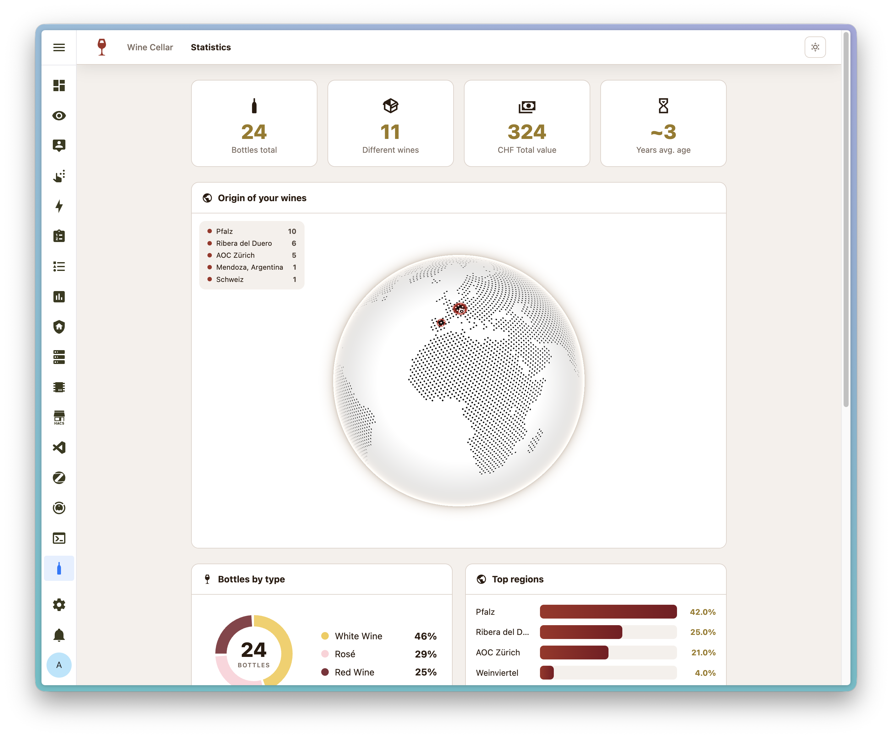

# Wine Tracker – Home Assistant Add-on

<p align="center">
  
</p>

![version][version-badge]
![project stage][stage-badge]
![maintained][maintained-badge]
![license][license-badge]
![languages][languages-badge]
![ha addon][ha-badge]
![ai powered][ai-badge]
![arch][arch-badge]

![github stars][stars-badge]
![github issues][issues-badge]
![last commit][commit-badge]
![commit activity][activity-badge]

A sleek, modern wine cellar tracker running as a Home Assistant add-on. Manage your entire collection — from label photo to tasting notes — directly in the HA sidebar.

## Screenshots

<p align="center">
  
</p>
<p align="center">
  
</p>
<p align="center">
  
  
</p>

## Features

- **Wine cards** with photo, vintage, type, region, grape variety, rating & notes
- **Photo upload** — snap a label photo from your phone
- **AI wine label recognition** — snap a label photo and let AI fill in all fields (supports 4 AI providers)
- **Vivino wine search** — search by name, see ratings, region & price, and import directly
- **Reload missing data** — re-analyze wines with incomplete fields via AI or Vivino
- **Star rating** (1–5 stars)
- **Quick quantity buttons** (+/−) directly on the card
- **Duplicate wines** — perfect when only the vintage changes
- **Empty bottles** stay visible as placeholders (toggle to hide)
- **Search & filter** by wine type
- **Drink window** (from/until year)
- **Purchase price** with configurable currency
- **Storage location** with autocomplete from existing entries
- **Region & purchase source** autocomplete from existing entries
- **Grape variety** (e.g. Merlot, Pinot Noir, Chardonnay) with autocomplete
- **Interactive globe** — see your wine regions on a 3D globe (COBE)
- **Statistics** — donut charts for wine types + total bottle count
- **Multi-language** — 7 languages supported
- **HA Ingress** — embedded directly in the Home Assistant sidebar
- **REST API** at `/api/summary` for HA sensors
- **Fully responsive** — works great on desktop & mobile

## Supported Languages

| Language | Code |
|----------|------|
| 🇩🇪 German | `de` |
| 🇬🇧 English | `en` |
| 🇫🇷 French | `fr` |
| 🇮🇹 Italian | `it` |
| 🇪🇸 Spanish | `es` |
| 🇵🇹 Portuguese | `pt` |
| 🇳🇱 Dutch | `nl` |

Set your preferred language in the add-on configuration (`language` option).

See [CHANGELOG.md](CHANGELOG.md) for the full version history.

## Installation

[![Add Repository to My Home Assistant][my-ha-badge]][my-ha-url]

Or install manually:

1. Go to **Settings → Add-ons → Add-on Store**
2. Top right: **⋮ → Repositories**
3. Add the repository URL: `https://github.com/xenofex7/ha-wine-tracker`
4. **Wine Tracker** will appear in the store
5. Click **Install → Start**

The add-on opens in the HA sidebar under **Wine Tracker**.

## Configuration

All options are configured via the Home Assistant add-on configuration page.

### General

| Option | Type | Default | Description |
|--------|------|---------|-------------|
| `currency` | string | `CHF` | Currency symbol displayed for prices (e.g. `EUR`, `USD`, `GBP`) |
| `language` | string | `de` | UI language — one of: `de`, `en`, `fr`, `it`, `es`, `pt`, `nl` |

### AI Wine Label Recognition

The AI feature lets you snap a photo of a wine label and automatically fills in the wine details (name, vintage, type, region, grape, price, notes).

| Option | Type | Default | Description |
|--------|------|---------|-------------|
| `ai_provider` | dropdown | `none` | AI provider: `none`, `anthropic`, `openai`, `openrouter`, `ollama` |
| `anthropic_api_key` | string | _(empty)_ | API key for Anthropic (Claude) |
| `anthropic_model` | string | `claude-opus-4-6` | Anthropic model name |
| `openai_api_key` | string | _(empty)_ | API key for OpenAI |
| `openai_model` | string | `gpt-5.2` | OpenAI model name |
| `openrouter_api_key` | string | _(empty)_ | API key for OpenRouter |
| `openrouter_model` | string | `anthropic/claude-opus-4.6` | OpenRouter model identifier |
| `ollama_host` | string | `http://localhost:11434` | Ollama server URL (for local AI) |
| `ollama_model` | string | `llava` | Ollama vision model name |

**Provider notes:**
- **Anthropic** — uses the Claude API directly. Requires an API key from [console.anthropic.com](https://console.anthropic.com)
- **OpenAI** — uses the OpenAI API. Requires an API key from [platform.openai.com](https://platform.openai.com)
- **OpenRouter** — a unified API that routes to many models. Requires an API key from [openrouter.ai](https://openrouter.ai). You can choose any vision-capable model.
- **Ollama** — runs fully local, no API key needed. Install [Ollama](https://ollama.com) and pull a vision model (e.g. `llava`). Set the host to your Ollama server address.

## Data Persistence

All data (SQLite database + photos) is stored under `/share/wine-tracker/` — preserved across add-on updates, restarts, and HA updates.

## Home Assistant Sensor (Optional)

```yaml
# configuration.yaml
sensor:
  - platform: rest
    name: "Wine Stock"
    resource: "http://localhost:5050/api/summary"
    value_template: "{{ value_json.total_bottles }}"
    unit_of_measurement: "bottles"
    json_attributes:
      - by_type
    scan_interval: 3600
```

This creates a `sensor.wine_stock` entity you can use on dashboards or in automations.

## Database Fields

| Field | Type | Description |
|-------|------|-------------|
| `name` | Text | Wine name (required) |
| `year` | Integer | Vintage year |
| `type` | Text | Wine type: Rotwein, Weisswein, Rosé, Schaumwein, Dessertwein, Likörwein, Anderes |
| `region` | Text | Origin (e.g. Piemont, IT) |
| `grape` | Text | Grape variety (e.g. Merlot, Pinot Noir) |
| `quantity` | Integer | Number of bottles (0 = placeholder) |
| `rating` | Integer | 1–5 stars |
| `notes` | Text | Free text |
| `image` | Text | Label photo filename |
| `added` | Date | Date added |
| `purchased_at` | Text | Purchase source |
| `price` | Real | Purchase price |
| `drink_from` | Integer | Drink window start (year) |
| `drink_until` | Integer | Drink window end (year) |
| `location` | Text | Storage location |
| `vivino_id` | Integer | Vivino vintage ID (linked when imported via Vivino search) |

## Technology

- **Backend**: Python 3 + Flask
- **Database**: SQLite (single file)
- **Frontend**: Vanilla HTML / CSS / JS (no framework, no Node.js)
- **AI**: Anthropic SDK, OpenAI SDK, Ollama REST API
- **Globe**: COBE (WebGL 3D globe)
- **Base image**: Home Assistant Alpine-based

## Roadmap

- Export / Import function
- Custom sorting options
- Display modes — list view or portal

## License

MIT

[version-badge]: https://img.shields.io/badge/version-v1.0.1-blue.svg
[stage-badge]: https://img.shields.io/badge/project%20stage-stable-brightgreen.svg
[maintained-badge]: https://img.shields.io/badge/maintained-yes-brightgreen.svg
[license-badge]: https://img.shields.io/badge/license-MIT-green.svg
[languages-badge]: https://img.shields.io/badge/languages-7-blue.svg
[ha-badge]: https://img.shields.io/badge/Home%20Assistant-Add--on-41BDF5.svg?logo=homeassistant&logoColor=white
[ai-badge]: https://img.shields.io/badge/AI%20powered-label%20recognition-blueviolet.svg
[arch-badge]: https://img.shields.io/badge/arch-aarch64%20|%20amd64%20|%20armhf%20|%20armv7-informational.svg
[stars-badge]: https://img.shields.io/github/stars/xenofex7/ha-wine-tracker?style=flat&logo=github
[issues-badge]: https://img.shields.io/github/issues/xenofex7/ha-wine-tracker?style=flat&logo=github
[commit-badge]: https://img.shields.io/github/last-commit/xenofex7/ha-wine-tracker?style=flat&logo=github
[activity-badge]: https://img.shields.io/github/commit-activity/y/xenofex7/ha-wine-tracker?style=flat&logo=github
[my-ha-badge]: https://my.home-assistant.io/badges/supervisor_add_addon_repository.svg
[my-ha-url]: https://my.home-assistant.io/redirect/supervisor_add_addon_repository/?repository_url=https%3A%2F%2Fgithub.com%2Fxenofex7%2Fha-wine-tracker
