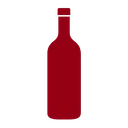
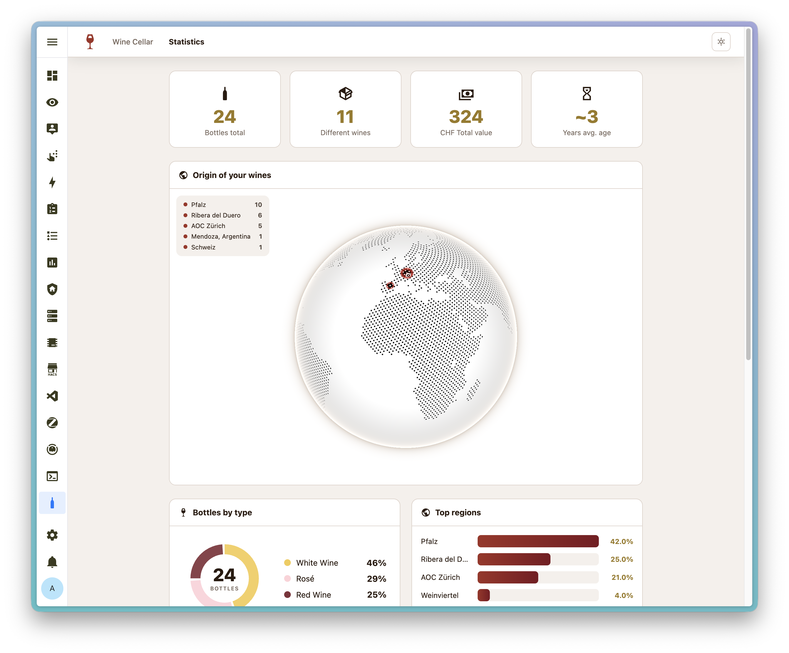

# Wine Tracker - Home Assistant Add-on & Docker Standalone

<p align="center">
  
</p>

![version][version-badge]
![project stage][stage-badge]
![maintained][maintained-badge]
![license][license-badge]
![languages][languages-badge]
![ha addon][ha-badge]
![ai powered][ai-badge]
![arch][arch-badge]
![docker][docker-badge]

![github stars][stars-badge]
![github issues][issues-badge]
![last commit][commit-badge]
![commit activity][activity-badge]

A wine cellar tracker for Home Assistant or Docker - manage your entire collection from label photo to tasting notes.

**📖 [Documentation & Demo →](https://xenofex7.github.io/ha-wine-tracker/)**

## Screenshots

<p align="center">
  
</p>
<p align="center">
  
</p>
<p align="center">
  
  
</p>

## Features

### Wine Management

- **Wine cards** with photo, vintage, type, region, grape variety, rating & notes
- **Photo upload** - snap a label photo from your phone
- **Star rating** (1-5 stars)
- **Quick quantity buttons** (+/-)  directly on the card
- **Duplicate wines** - perfect when only the vintage changes
- **Bottle format** - track sizes from Piccolo (0.1875l) to Nebuchadnezzar (15l)
- **Empty bottles** stay visible as placeholders (toggle to hide)
- **Drink window** (from/until year)
- **Purchase price** with configurable currency
- **Storage location** with autocomplete from existing entries
- **Region & purchase source** autocomplete from existing entries
- **Grape variety** (e.g. Merlot, Pinot Noir, Chardonnay) with autocomplete

### AI & Integrations

- **AI label recognition** - snap a label photo and let AI fill in all fields, including maturity phases, taste profile and food pairings (5 providers: Anthropic, OpenAI, OpenRouter, Ollama, MiniMax)
- **Vivino wine search** - search by name, see ratings, region & price, and import directly - with a regional fallback chain so country-specific wines (e.g. Australian labels) actually show up
- **Vivino ID management** - view, edit & test Vivino wine links directly in the edit modal
- **Reload missing data** - re-analyze wines with incomplete fields via AI or Vivino
- **AI sommelier chat with full CRUD** - ask questions about your cellar, upload wine label photos, and add / edit / delete wines directly from the conversation - with persistent chat history
- **Maturity graph** - AI-generated bell curve showing drinking phases (Youth, Maturity, Peak, Decline)
- **Taste profile & food pairings** - AI-generated body/tannin/acidity/sweetness bars and matching dish suggestions

### Views & Statistics

- **Cellar view modes** - switch between Cards, List, Grid, and Table view
- **Sortable table view** - sort by any column with persistent sort direction
- **Search & filter** by wine type, vintage & grape variety
- **Activity timeline** - chronological log of wines added, consumed, restocked, or removed
- **Interactive globe** - see your wine regions on a 3D globe (COBE)
- **Stock history chart** - area chart showing bottle count development over the last 6 months
- **Statistics** - donut charts, total bottles, total liters, value overview & average age

### UI & Platform

- **6 themes** - each with dark & light mode, switchable in settings
- **Hamburger menu** - navigation collapses on narrow viewports
- **Fully responsive** - works great on desktop & mobile
- **Multi-language** - 7 languages (DE, EN, FR, IT, ES, PT, NL)
- **HA Ingress** - embedded directly in the Home Assistant sidebar
- **REST API** at `/api/summary` for HA sensors
- **DEV_AUTH mode** - `DEV_AUTH` env var for quick local development without Home Assistant
- **Backup & restore** - export the whole cellar as a ZIP (JSON + CSV + images) and import it back with duplicate preview

## Supported Languages

7 languages: German (`de`), English (`en`), French (`fr`), Italian (`it`), Spanish (`es`), Portuguese (`pt`), Dutch (`nl`). Set via the `language` option.

See [CHANGELOG.md](CHANGELOG.md) for the full version history and [ROADMAP.md](ROADMAP.md) for planned features.

## Installation - Home Assistant Add-on

[![Add Repository to My Home Assistant][my-ha-badge]][my-ha-url]

Or install manually:

1. Go to **Settings → Add-ons → Add-on Store**
2. Top right: **⋮ → Repositories**
3. Add the repository URL: `https://github.com/xenofex7/ha-wine-tracker`
4. **Wine Tracker** will appear in the store
5. Click **Install → Start**

The add-on opens in the HA sidebar under **Wine Tracker**.

## Installation - Docker Standalone

Run Wine Tracker without Home Assistant using Docker Compose.

### Quick Start

1. Create a `docker-compose.yml`:

```yaml
services:
  wine-tracker:
    image: ghcr.io/xenofex7/wine-tracker:latest
    ports:
      - "5050:5050"
    volumes:
      - wine-data:/data
    environment:
      - AUTH_ENABLED=true
      - USERS=admin:changeme
      - SECRET_KEY=change-this-to-a-random-string
      - CURRENCY=CHF
      - LANGUAGE=de
    restart: unless-stopped

volumes:
  wine-data:
```

> **Full example:** See [`docker/docker-compose.yml`](docker/docker-compose.yml) for a complete configuration with all available options.

2. Start it:

```bash
docker-compose up -d
```

3. Open **http://localhost:5050** and log in.

### Environment Variables

#### Authentication

| Variable | Default | Description |
|----------|---------|-------------|
| `AUTH_ENABLED` | `false` | Enable login (`true` / `false`) |
| `USERS` | _(empty)_ | User list (see format below) |
| `SECRET_KEY` | _(random)_ | Session encryption key - set a fixed value for persistence across restarts |

**User format:** `user1:password1,user2:password2,guest:password3:readonly`

- Users are comma-separated
- Each user is `username:password` (full access) or `username:password:readonly` (view only)
- Readonly users can browse and search wines but cannot add, edit, or delete

#### General

| Variable | Default | Description |
|----------|---------|-------------|
| `CURRENCY` | `CHF` | Currency symbol - `CHF`, `EUR`, `USD`, `GBP`, `CAD`, `AUD` |
| `LANGUAGE` | `de` | UI language - `de`, `en`, `fr`, `it`, `es`, `pt`, `nl` |

#### AI Provider (optional - pick one)

| Variable | Default | Description |
|----------|---------|-------------|
| `AI_PROVIDER` | `none` | AI provider: `none`, `anthropic`, `openai`, `openrouter`, `ollama`, `minimax` |

**Anthropic (Claude):**

| Variable | Default |
|----------|---------|
| `ANTHROPIC_API_KEY` | _(empty)_ |
| `ANTHROPIC_MODEL` | `claude-opus-4-6` |

**OpenAI (GPT):**

| Variable | Default |
|----------|---------|
| `OPENAI_API_KEY` | _(empty)_ |
| `OPENAI_MODEL` | `gpt-5.2` |

**OpenRouter (multi-provider):**

| Variable | Default |
|----------|---------|
| `OPENROUTER_API_KEY` | _(empty)_ |
| `OPENROUTER_MODEL` | `anthropic/claude-opus-4.6` |

**Ollama (local, no API key needed):**

| Variable | Default |
|----------|---------|
| `OLLAMA_HOST` | `http://localhost:11434` |
| `OLLAMA_MODEL` | `llava` |

> **Tip:** When running Ollama in a separate container, use `http://host.docker.internal:11434` as the host.

**MiniMax:**

| Variable | Default |
|----------|---------|
| `MINIMAX_API_KEY` | _(empty)_ |
| `MINIMAX_MODEL` | `MiniMax-Text-01` |

> **Note:** `MiniMax-Text-01` is MiniMax's current vision-capable model - despite the name it accepts image input. The older `MiniMax-VL-01` name is no longer accepted by the API.

### Updating

```bash
docker-compose pull
docker-compose up -d
```

### Data Persistence (Docker)

All data (SQLite database + photos) is stored in the Docker volume mounted at `/data`. As long as you keep the volume, your data survives container updates.

## Configuration (Home Assistant)

All options are configured via the Home Assistant add-on configuration page.

### General

| Option | Type | Default | Description |
|--------|------|---------|-------------|
| `currency` | string | `CHF` | Currency symbol displayed for prices (e.g. `EUR`, `USD`, `GBP`) |
| `language` | string | `de` | UI language - one of: `de`, `en`, `fr`, `it`, `es`, `pt`, `nl` |

### AI Wine Label Recognition

The AI feature lets you snap a photo of a wine label and automatically fills in the wine details (name, vintage, type, region, grape, price, notes).

| Option | Type | Default | Description |
|--------|------|---------|-------------|
| `ai_provider` | dropdown | `none` | AI provider: `none`, `anthropic`, `openai`, `openrouter`, `ollama`, `minimax` |
| `anthropic_api_key` | string | _(empty)_ | API key for Anthropic (Claude) |
| `anthropic_model` | string | `claude-opus-4-6` | Anthropic model name |
| `openai_api_key` | string | _(empty)_ | API key for OpenAI |
| `openai_model` | string | `gpt-5.2` | OpenAI model name |
| `openrouter_api_key` | string | _(empty)_ | API key for OpenRouter |
| `openrouter_model` | string | `anthropic/claude-opus-4.6` | OpenRouter model identifier |
| `ollama_host` | string | `http://localhost:11434` | Ollama server URL (for local AI) |
| `ollama_model` | string | `llava` | Ollama vision model name |
| `minimax_api_key` | string | _(empty)_ | API key for MiniMax |
| `minimax_model` | string | `MiniMax-Text-01` | MiniMax model name (vision-capable despite the name) |

**Provider notes:**
- **Anthropic** - uses the Claude API directly. Requires an API key from [console.anthropic.com](https://console.anthropic.com)
- **OpenAI** - uses the OpenAI API. Requires an API key from [platform.openai.com](https://platform.openai.com)
- **OpenRouter** - a unified API that routes to many models. Requires an API key from [openrouter.ai](https://openrouter.ai). You can choose any vision-capable model.
- **Ollama** - runs fully local, no API key needed. Install [Ollama](https://ollama.com) and pull a vision model (e.g. `llava`). Set the host to your Ollama server address.
- **MiniMax** - OpenAI-compatible API from [minimaxi.chat](https://api.minimaxi.chat). The default model `MiniMax-Text-01` supports vision input despite the name; the older `MiniMax-VL-01` name is no longer accepted by the API.

Token cost varies by provider and model - typical analysis is ~2,500 tokens. See the provider's pricing page for current rates. Ollama runs locally and is free.

## Data Persistence (Home Assistant)

All data (SQLite database + photos) is stored under `/share/wine-tracker/` - preserved across add-on updates, restarts, and HA updates.

## Home Assistant Sensor (Optional)

```yaml
# configuration.yaml
sensor:
  - platform: rest
    name: "Wine Stock"
    resource: "http://localhost:5050/api/summary"
    value_template: "{{ value_json.total_bottles }}"
    unit_of_measurement: "bottles"
    json_attributes:
      - by_type
    scan_interval: 3600
```

This creates a `sensor.wine_stock` entity you can use on dashboards or in automations.

## License

MIT

[version-badge]: https://img.shields.io/badge/version-v1.9.2-blue.svg
[stage-badge]: https://img.shields.io/badge/project%20stage-stable-brightgreen.svg
[maintained-badge]: https://img.shields.io/badge/maintained-yes-brightgreen.svg
[license-badge]: https://img.shields.io/badge/license-MIT-green.svg
[languages-badge]: https://img.shields.io/badge/languages-7-blue.svg
[ha-badge]: https://img.shields.io/badge/Home%20Assistant-Add--on-41BDF5.svg?logo=homeassistant&logoColor=white
[ai-badge]: https://img.shields.io/badge/AI%20powered-label%20recognition-blueviolet.svg
[arch-badge]: https://img.shields.io/badge/arch-aarch64-informational.svg
[stars-badge]: https://img.shields.io/github/stars/xenofex7/ha-wine-tracker?style=flat&logo=github
[issues-badge]: https://img.shields.io/github/issues/xenofex7/ha-wine-tracker?style=flat&logo=github
[commit-badge]: https://img.shields.io/github/last-commit/xenofex7/ha-wine-tracker?style=flat&logo=github
[activity-badge]: https://img.shields.io/github/commit-activity/y/xenofex7/ha-wine-tracker?style=flat&logo=github
[docker-badge]: https://img.shields.io/badge/Docker-standalone-2496ED.svg?logo=docker&logoColor=white
[my-ha-badge]: https://my.home-assistant.io/badges/supervisor_add_addon_repository.svg
[my-ha-url]: https://my.home-assistant.io/redirect/supervisor_add_addon_repository/?repository_url=https%3A%2F%2Fgithub.com%2Fxenofex7%2Fha-wine-tracker
